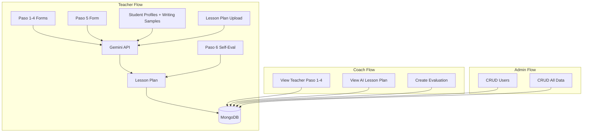

# Coaching Caminos Full Implementation Plan

## Architecture Overview




---

## 0. Git / .gitignore Configuration

Ensure `.env` files are never committed:

- **Root [.gitignore](.gitignore):** Add a project-root `.gitignore` (if missing) with:
  ```
  .env
  .env.*
  !.env.example
  ```
  This covers `server/.env`, `my-app/.env`, and any root `.env`.

- **Server [server/.gitignore](server/.gitignore):** Add `server/.gitignore` with at least:
  ```
  .env
  .env.local
  .env.*.local
  node_modules/
  ```
  So `server/.env` is ignored even if the repo is used without a root `.gitignore`.

- **Verify:** [my-app/.gitignore](my-app/.gitignore) already includes `.env`, `.env.local`, and related variants. No change needed there.

- **Before first commit:** Run `git status` and confirm no `.env` files appear. Keep `.env.example` (no secrets) committed as a template.

---

## 1. MongoDB Models

Create models in [server/models/](server/models/):


| Model               | Purpose                                                                                                                                                                                             |
| ------------------- | --------------------------------------------------------------------------------------------------------------------------------------------------------------------------------------------------- |
| **TeacherCycle**    | Groups all Paso data for a teacher in a cycle (e.g., semester). References `teacherId`, has `status`, `createdAt`.                                                                                  |
| **Paso1Submission** | Knowledge of Self. Sub-docs or fields: `positionality`, `assumptions`, `relationshipToStudents`, `awarenessOfBias`, `instructionalIntention`. `teacherCycleId`.                                     |
| **Student**         | Per-teacher student. `teacherId`, `teacherCycleId`, `name`, `demographics` (object), `writingSamplePre` (text or file ref), `writingSamplePost`, `llmEvaluation` (LLM feedback on writing).         |
| **Paso2Submission** | One per student. Links to `Student`, contains form fields.                                                                                                                                          |
| **Paso3Submission** | Preliminary lesson plan (form + optional file). `teacherCycleId`.                                                                                                                                   |
| **Paso4Submission** | District guidelines form. `teacherCycleId`.                                                                                                                                                         |
| **Paso5Submission** | Partner with students/families. Fields: `homeLanguageSupport`, `equitableTreatment`, `engagementLevel`, etc. `teacherCycleId`.                                                                      |
| **Paso6Submission** | Practice of Advocacy. Four sub-forms: `understandingProficiency`, `instructionalAdjustments`, `equitableAdvocacy`, `parentInclusion`. Plus `studentParentFeedback` questionnaire. `teacherCycleId`. |
| **LessonPlan**      | `teacherId`, `teacherCycleId`, `content` (generated text), `paso1to5Input` (snapshot for audit), `paso5Id`, `paso6Id`, `status`, `createdAt`.                                                       |
| **CoachEvaluation** | `coachId`, `teacherId`, `lessonPlanId`, `strengths`, `areasForImprovement`, `suggestions`, `createdAt`.                                                                                             |


**File storage:** Use `multer` for uploads. Store small text (writing samples) in documents; for larger files, use GridFS or a `uploads/` directory with paths in the DB. Add `GEMINI_API_KEY` to [server/.env.example](server/.env.example).

---

## 2. Gemini LLM Integration

- **Package:** `@google/genai` (current SDK; `@google/generative-ai` is deprecated).
- **Env:** `GEMINI_API_KEY` in `.env`.
- **Service:** [server/services/gemini.js](server/services/gemini.js) with `generateLessonPlan(paso1to5Data)`.
- **Flow:** Accept Paso 1-5 payload, build a structured prompt, call Gemini, return generated lesson plan text.
- **Route:** `POST /api/llm/generate-lesson-plan` (auth required, teacher role). Request body: `{ teacherCycleId }` or raw Paso data. Server fetches Paso 1-5 + Student data, calls Gemini, saves `LessonPlan` doc, returns it.

---

## 3. API Routes (Express)

All routes use `requireAuth` middleware. Role checks via `requireRole`.


| Route                              | Method           | Auth    | Purpose                                       |
| ---------------------------------- | ---------------- | ------- | --------------------------------------------- |
| `/api/cycles`                      | GET, POST        | Teacher | List/create teacher cycles                    |
| `/api/cycles/:id`                  | GET              | Teacher | Get cycle + Paso data                         |
| `/api/cycles/:id/paso/1`           | GET, PUT         | Teacher | Paso 1 CRUD                                   |
| `/api/cycles/:id/paso/2`           | GET, PUT         | Teacher | Paso 2 (students) CRUD                        |
| `/api/cycles/:id/paso/3`           | GET, PUT         | Teacher | Paso 3 CRUD                                   |
| `/api/cycles/:id/paso/4`           | GET, PUT         | Teacher | Paso 4 CRUD                                   |
| `/api/cycles/:id/paso/5`           | GET, PUT         | Teacher | Paso 5 CRUD                                   |
| `/api/cycles/:id/paso/6`           | GET, PUT         | Teacher | Paso 6 CRUD                                   |
| `/api/students`                    | POST             | Teacher | Create student (with optional writing sample) |
| `/api/students/:id/writing-sample` | POST             | Teacher | Upload writing sample; trigger LLM eval       |
| `/api/llm/generate-lesson-plan`    | POST             | Teacher | Generate lesson plan from Paso 1-5            |
| `/api/lesson-plans`                | GET              | Teacher | List own lesson plans                         |
| `/api/coaches/teachers`            | GET              | Coach   | List teachers (for coach view)                |
| `/api/coaches/teachers/:teacherId` | GET              | Coach   | Teacher Paso 1-4 + lesson plan                |
| `/api/coaches/evaluations`         | POST             | Coach   | Create evaluation for teacher                 |
| `/api/admin/users`                 | GET, PUT, DELETE | Admin   | User CRUD                                     |
| `/api/admin/`*                     | *                | Admin   | Proxy to teacher/coach data with full CRUD    |


---

## 4. Frontend: Teacher Dashboard

Refactor [my-app/src/TeacherDashboard.js](my-app/src/TeacherDashboard.js) to support navigation into Paso forms.

**Structure:**

- **Sidebar:** PRE CONFERENCE (Paso 1-4): Teacher Efficacy Survey, Student Profile, Sociopolitical Dynamics, Lesson Plan; POST CONFERENCE (Paso 5-6): Partner with Students, Practice of Advocacy.
- **Main area:** Route by step (e.g., `/teacher/cycle/:cycleId/paso/:step` or in-app state).

**Paso forms (match attached images):**

- **Paso 1:** Multi-section form (5 sub-questionnaires). Sections: Positionality, Assumptions, Relationship to Students, Awareness of Bias, Instructional Intention. Each with textarea + description. Save Draft, Next Step.
- **Paso 2:** Wizard: Basic Info, Knowledge of Other, Learning Goals, Support Needs, Assessment, Final Review. One form per student. Add student + upload writing sample. Writing sample: file upload, send to backend for LLM eval, store pre/post.
- **Paso 3:** Form for preliminary lesson plan (upload + form fields).
- **Paso 4:** Form for district guidelines.
- **Paso 5:** Form: Home language support, Equitable treatment, Engagement level, Partner with students/families.
- **Paso 6:** Four cards: Understanding and proficiency, Instructional adjustments, Equitable education advocacy, Parent inclusion. Each with progress + form. Plus student/parent feedback questionnaire.

**Lesson plan flow:** After Paso 5 complete, "Generate Lesson Plan" button calls `/api/llm/generate-lesson-plan`. Show loading, then display generated plan. Link Paso 5-6 and observation/evaluation to it.

**Add:** React Router for `/teacher`, `/teacher/cycle/:id`, `/teacher/cycle/:id/paso/:step`. Use existing green theme and card layout from [my-app/src/App.css](my-app/src/App.css).

---

## 5. Frontend: Coach Dashboard

Refactor [my-app/src/CoachDashboard.js](my-app/src/CoachDashboard.js).

**Features:**

- **Teacher list:** List teachers (from backend). Click to view details.
- **Teacher detail view:** Tabs or sections: Paso 1-4 survey data, Student profiles (if visible), AI-generated lesson plan.
- **Create evaluation:** Form for strengths, areas for improvement, suggestions. Submit to `POST /api/coaches/evaluations` with `teacherId`, `lessonPlanId`.

**API:** `GET /api/coaches/teachers` returns teachers with summary; `GET /api/coaches/teachers/:id` returns full Paso 1-4 + lesson plan for that teacher.

---

## 6. Frontend: Admin Dashboard

**Features:**

- **Users:** Table of users (role, email, name). Edit, delete. Create user (admin only).
- **Data override:** Browse teacher cycles, lesson plans, evaluations. Edit/delete where appropriate (admin-only).

**API:** `GET/PUT/DELETE /api/admin/users`, plus admin-specific endpoints that mirror teacher/coach APIs with elevated permissions.

---

## 7. Implementation order

1. **Phase 1 – Data layer:** MongoDB models, migrations/indexes if needed.
2. **Phase 2 – Gemini:** `server/services/gemini.js`, `generateLessonPlan`, prompt design.
3. **Phase 3 – Teacher API:** Cycles, Paso 1-6 routes, student + writing sample routes, lesson plan generation route.
4. **Phase 4 – Teacher UI:** React Router, Paso 1-6 form components, step navigation, save/load.
5. **Phase 5 – Coach API + UI:** Coach routes, teacher list/detail, evaluation creation.
6. **Phase 6 – Admin API + UI:** Admin routes, user CRUD, data management UI.

---

## 8. Dependencies

**Server:** `@google/genai`, `multer` (file uploads).

**Frontend:** `react-router-dom` (routing).

---

## 9. Env variables

Add to [server/.env.example](server/.env.example):

```
GEMINI_API_KEY=your_gemini_api_key
```

---

## 10. Notes

- **Writing sample LLM eval:** Backend receives uploaded file/text, calls Gemini to evaluate, stores result in `Student.llmEvaluation` and `writingSamplePost` (or similar).
- **Paso 5 in LLM input:** User spec says Paso 1-5 feed the lesson plan. Paso 5 is included in the payload sent to Gemini.
- **Paso 5-6 attachment:** Lesson plan document stores `paso5Id`, `paso6Id` for linking observation/evaluation forms.

